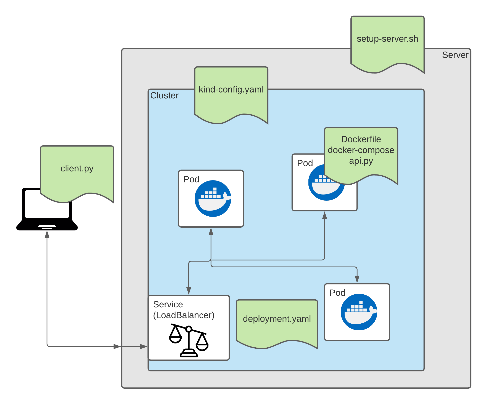
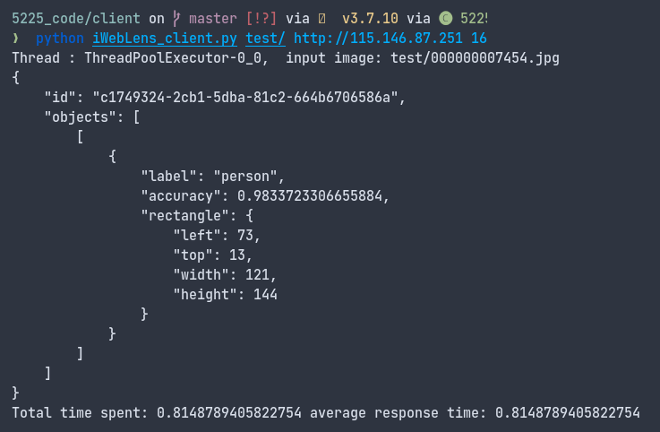

# Object Detection Web Service

Object Detection web service within a containerised environment using Docker and Kubernetes. You can run this locally and on a remote server using Kind - a single machine abstraction for Kubernetes.

- [Github Repo](https://github.com/yohanderose/object-detection-webservice.git)
- [Docker Base Image](https://hub.docker.com/r/yohanderose/5225_ojbdetector)
- [YouTube Video](https://www.youtube.com/watch?v=5oJUDmqMXdc&t=2s)
- Nectar Instance (3 Pods) @ 115.146.86.35:80



## Dependencies 🐳

- Ubuntu 18.04
- Docker
- Python > 3.5

## Usage ️️️️️️️️️⚙️

```bash
git clone https://github.com/yohanderose/object-detection-webservice.git
cd object-detection-webservice
```

### Server

```bash
bash setup-server.sh
```

This script:

1. Installs remaining dependencies (kubectl, kind)
2. Starts docker, creates cluster and spins up the deployment

### Client

Interact with your server using

```bash
python client/iWebLens_client.py <path to dir of images>/ http://<server ip> <num threads>
# example: python iWebLens_client.py test/ http://localhost 16
# yohan's server: python iWebLens_client.py test/ http://118.138.237.116 16
```


